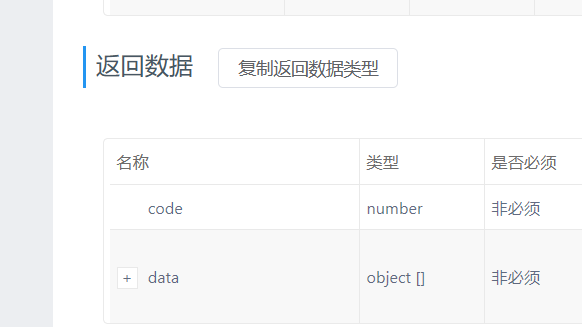
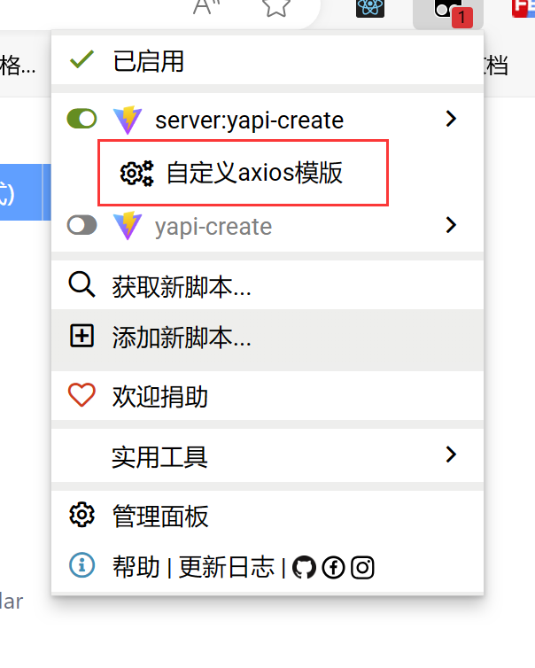
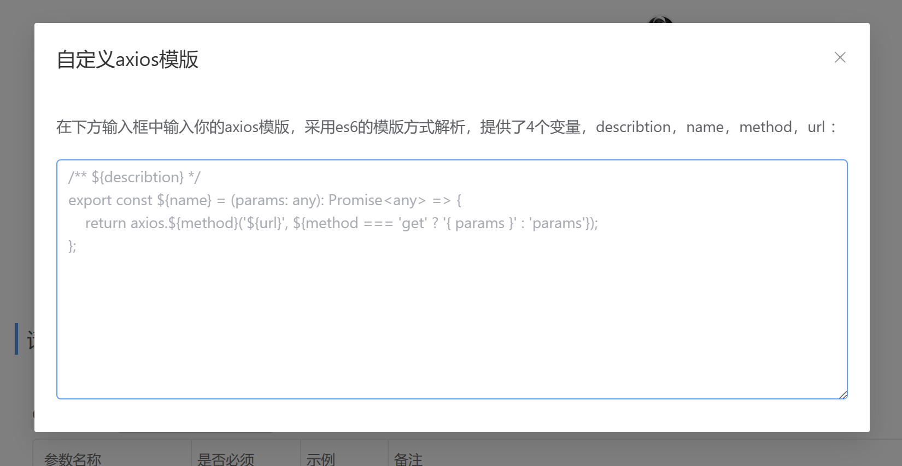

# user-script 

自己写的油猴脚本

# 列表

也可以打开lib文件夹，复制相应的脚本

| 名称                        | 简介                                   | 在线安装                                                     |
| --------------------------- | -------------------------------------- | ------------------------------------------------------------ |
| [yapi-create](#yapi-create) | 自动生成yapi的接口请求以及参数的ts类型 | [yapi-create (greasyfork.org)](https://greasyfork.org/zh-CN/scripts/478536-yapi-create) |

# yapi-create

- 直接创建并复制axios请求
- 支持自定义axios模板
- 复制请求参数类型
- 创建返回数据类型（只能生成展开行的类型），右键可创建每一行及其子元素的类型集合

